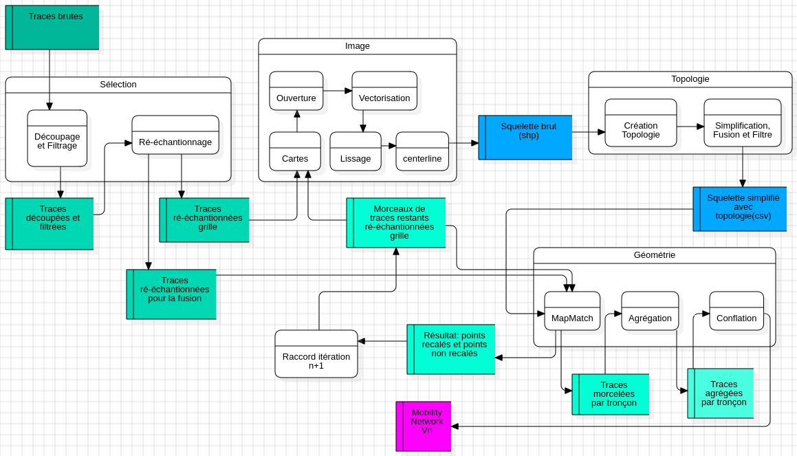

# OutdoorFootprintNetworkPipeline (OFNP)

OFNP is an open-source Python processing pipeline (MIT license) for generating outdoor activity footprint networks from GNSS trajectories, representing, for example, hikers’ or runners’ footprints within a defined spatial and temporal extent. The pipeline consists of several components, including GNSS point map-matching onto a network and trajectory merging, both implemented using the Tracklib Python library.

The outdoor footprint network is defined by :

* a topology graph G (V, E) : a set of vertex V and a set of edges E, E ⊆ V x V non oriented
* a geometry for each edge E defined as as sequence of vertics (x, y, z) and represents accurately the common path followed by all the individual sample trajectories (i.e. accurate aggregate trajectories)

<table style="border:none;border:0;width:60%"><tr>
  <td align="center" style="width:30%">
    
     <label>Raw GNSS trajectories</label>
  </td>
  <td style="padding:16px;">
    
     <label>Outdoor Footprint Network</label>
  </td>
</tr></table>

The two figures above illustrate the pipeline input (left) and output (right).

 

> Table of Contents
> - [Pipeline Overview](#pipeline-overview)
>     * [Préparation des traces brutes]()
>     * [Création des cartes de pratiques sportives et extrait du réseau]()
>     * [Calcul de la topologie du réseau]()
>     * [Calcul de la géométrie des arcs du réseau]()
>     * [Second pass]()
> - [Environment Setup](#environment-setup)
>     * Requirements
>     * Environment Setup
>     * How to Run the Code

 

# Pipeline Overview

Le pipeline a été testé sur 3 zones d'études:

- study area 1 dans les Bauges : 4145 traces, 1172 traces après filtrage,   3km x 2.5km
- study area 2 dans la vallée de Chamonix - Mont Blanc
- study ??

Le pipeline est composé de 5 briques à exécuter une par une:

|           |DESCRIPTION                    |OUTPUT DIR                   |
|-----------|-------------------------------|-----------------------------|
|Script 1   | filtre, decoup, resample      | decoup, resample            |
|Script 2   | création et traitement images | image, network              |
|Script 3   | topologie                     | network                     |
|Script 4   | recalage, fusion et raccord   | mapmatch, geometry          |
|Script 5   | second pass                   | geometry                    |

Les scripts se lancent dans une console Python. 

Temps d'exécution approximatif: xxx min (500+155+50+300+)

  

Paramètres à renseigner :
--------------------------

* Le répertoire qui contient les traces au format CSV (un fichier par trace)
    
        tracescsvpath = r'/home/md_vandamme/5_GPS/OV/BAUGES/run/'

* Le répertoire qui va contenir tous les résultats : 

        tracespath = r'/home/md_vandamme/4_RESEAU/ExampleRunning/traces/'. 

  Chaque script lit et enregistre (col 3) des résultats dans un répertoire ou plusieurs répertoires. 

* Limites de la zone d'étude sous forme de coordonnées des sommets des vertex d'un polygone:

  X = [945878, 956330, 955879, 954402, 952511, 950389, 948774, 945857, 945878]

  Y = [6516870, 6516805, 6508417, 6506849, 6506503, 6505649, 6504150, 6503762, 6516870]

* RESAMPLE_SIZE = 1

* NB_OBS_MIN    = 10 # nombre de points minimum pour une trace

* DIST_MAX_2OBS = 50 # si supérieur on coupe la trace. Par exemple : a stop can create a break in the trajectory

 

Ci-dessous un détail de chaque brique: 

 
<!-- ===================================================================================================== -->
<!-- ===================================================================================================== -->

## Script 1: *Préparation des traces brutes*

Ce script prend en entrée des traces brutes en entrée du pipeline. A la fin du script un nouveau jeu de traces est produit, extraites, découpées et sélectionnées si elle traverse une figure géométrique, résolues spatialement à 1 mètre.

=> produit un jeu de traces, résolues spatialement à 1 mètre, 
                    extraites (peut-être découpées) suivant une figure géométrique

Découpage et ré-échantillonnage des traces brutes

 
<!-- ===================================================================================================== -->
<!-- ===================================================================================================== -->

## Script 2: *Création des cartes de pratiques sportives et extrait du réseau*

Calculs des cartes de densité, de contraste et binaire

=> produit un jeu de traces résolues spatialement à 1 mètre

Filtre morphologique, Vectorisation, Squeletisation

 
<!-- ===================================================================================================== -->
<!-- ===================================================================================================== -->

## Script 3: *Calcul de la topologie du réseau*

 
<!-- ===================================================================================================== -->
<!-- ===================================================================================================== -->

## Script 4: *Calcul de la géométrie des arcs du réseau*

 

# Environment Setup

## Requirements

OutdoorFootprintNetworkPipeline requires the following Python packages and Plugin QGIS:

- Tracklib
- osgeo : gdal, ogr, osr (pour la partie vectorisation)
- Fiona, Shapely (centerline et smooth)

## "Just want to run the pipeline on a use case" Environment Setup

1. Install tracklib

2. Configuer dans QGis la librairie tracklib:

Cliquer dans la barre de menu sur Préférences >> Options >> Système >> 

Puis dans le bloc "Environnement", ajouter une variable personnalisée:

*Appliquer* : ajouter au début
*Variable*  : PYTHONPATH
*Valeur*    : /home/glagaffe/7_LIB/tracklib

## How to Run the Code

### Input

A GNSS trace dataset in CSV format is required.

### Execution

Run this source code in the Python console. Execute MainWorkflow.py to start the creation scripts.

# Development & Contributions

* Institute: LASTIG, Univ Gustave Eiffel, Géodata Paris, IGN
* License: MIT license
* Authors:
  - Marie-Dominique Van Damme
  - Yann Méneroux

