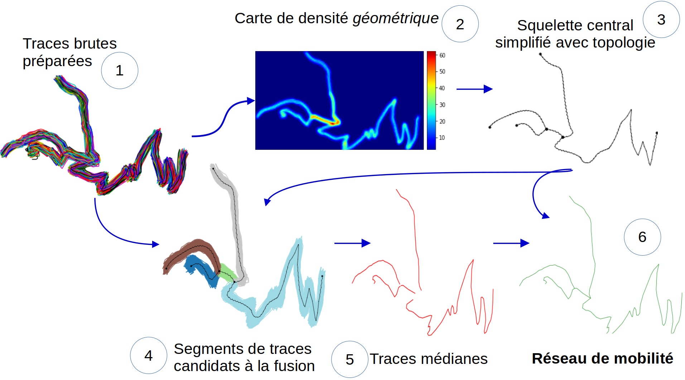

:Author: Marie-Dominique Van Damme
:Version: 1.0
:License: --
:Date: 08/04/2026

Pipeline overview
==================

.. Approche itérative

TODO

Première itération & Principe
------------------------------

.. Déroulement d'une itération du pipeline
.. Première itération : principe de fonctionnement

  **Figure 1.** À partir des traces GNSS brutes, une carte de densité est construite afin d'extraire un squelette central servant de référence topologique. Les traces sont ensuite découpées en segments candidats à la fusion, regroupés pour calculer des trajectoires médianes, puis assemblées pour produire le réseau de mobilité final.

Les différentes étapes de l'algorithme, décrites après, peuvent être résumées ainsi:

0. Préparation des traces brutes
1. Calcul de cartes de densité à partir des traces GNSS
2. De la vectorisation, on extrait une ligne centrée ≡ arc de la topologie.
3. Attributione des points des traces brutes à chaque arc de la topologie
4. Construction de bons morceaux de traces candidats pour chaque arc de la topologie puis agrégation des morceaux de traces
5. Conflation des traces fusionnées afin d’obtenir un réseau de mobilit

  
*Préparation des traces brutes*
"""""""""""""""""""""""""""""""""

Ce script prend en entrée des traces brutes en entrée du pipeline. A la fin du script un nouveau jeu de traces est produit, extraites, découpées et sélectionnées si elle traverse une figure géométrique, résolues spatialement à 1 mètre.

=> produit un jeu de traces, résolues spatialement à 1 mètre, 
                    extraites (peut-être découpées) suivant une figure géométrique

Découpage et ré-échantillonnage des traces brutes

*Calcul d’une carte de densité à partir des traces GNSS*
""""""""""""""""""""""""""""""""""""""""""""""""""""""""

Calculs des cartes de densité, de contraste et binaire à partir des traces GNSS 

=> produit un jeu de traces résolues spatialement à 1 mètre

- De la vectorisation on extrait une ligne centrée ≡ arc de la topologie 

avec Filtre morphologique, Vectorisation, Squeletisation

*Calcul de la topologie du réseau*
""""""""""""""""""""""""""""""""""""

*Calcul de la géométrie des arcs du réseau*
""""""""""""""""""""""""""""""""""""""""""""

*Conflation des traces fusionnées*
"""""""""""""""""""""""""""""""""""

Correction élastique de la géométrie du réseau

Itérations et embranchements
------------------------------

