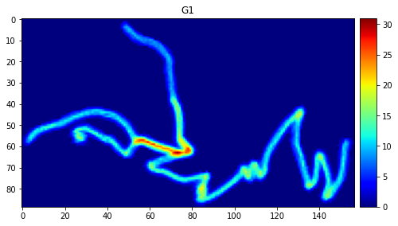
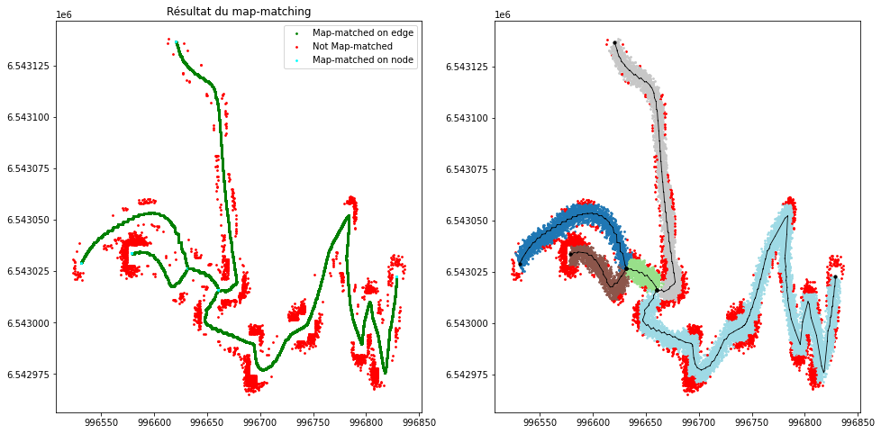

:Author: Marie-Dominique Van Damme
:Version: 1.0
:License: --
:Date: 07/06/2026

Visualiser les résultats
=========================

Objectif
^^^^^^^^^

Le pipeline se compose de trois grandes phases regroupant plusieurs briques de traitement (voir workflow). En plus du réseau de mobilité produit en sortie, de nombreuses données intermédiaires sont générées et stockées sous différents formats : fichiers Shapefile, images TIF, fichiers ASC, fichiers CSV ou encore ensembles de fichiers organisés dans des répertoires.

Afin de faciliter l'analyse, le choix des paramètres et la validation des résultats, plusieurs fonctions de visualisation ont été implémentées. Certaines sont génériques et nécessitent simplement de spécifier le fichier à afficher (par exemple les fichiers Shapefile ou TIF), tandis que d'autres sont dédiées à des étapes spécifiques du pipeline.

Cette section présente les différentes fonctions de visualisation disponibles ainsi que les données qu'elles permettent d'explorer.

Registre des jeux de données à visualiser
^^^^^^^^^^^^^^^^^^^^^^^^^^^^^^^^^^^^^^^^^^

Le tableau ci-dessous présente l'ensemble des données produites au cours de l'exécution du pipeline. Pour chacune d'elles sont indiqués son format, la fonction ou la méthode permettant sa visualisation, ainsi qu'une brève description de son contenu.

Dans le nom des données, le suffixe *NN* indique que la donnée dépend du numéro de l'itération qui l'a générée. Dans ce cas, il convient de remplacer NN par le numéro de l'itération considérée.

La plupart des fonctions de visualisation sont issues de la bibliothèque tracklib. Dans ce cas, leur nom est indiqué avec le préfixe tkl., la classe qui permet de charger les données, suivi du nom de la fonction ou de la méthode à utiliser.

Des exemples de visualisation sont fournis pour la majorité des données dans la section suivante.

+------------------------+------------+---------------------------+--------------------------------------+
| Donnée                 |  Format    | Fonction de visualisation | Description                          |
+========================+============+===========================+======================================+
| decoup                 | Répertoire | tkl.collection.plot       | Traces brutes découpées              |
+------------------------+------------+---------------------------+--------------------------------------+
| resample_fusion        | Répertoire | tkl.collection.plot       | Traces brutes découpées et           |
|                        |            |                           | ré-échantillonnées à 5 mètres        |
+------------------------+------------+---------------------------+--------------------------------------+
| resample_grid          | Répertoire | tkl.collection.plot       | Traces brutes découpées              |
|                        |            |                           | ré-échantillonnées à 1 mètres        |
+------------------------+------------+---------------------------+--------------------------------------+
| points_not_mm_NN       | Répertoire |                           | Traces reconstruites après la fin de |
|                        |            |                           | fin de l’itération précédente avec   |
|                        |            |                           | les points non recalés (échant. 5m)  |
+------------------------+------------+---------------------------+--------------------------------------+
| G1_NN                  | ASC        | tkl.raster.plotAsImage    | Carte de densité géométrique         |
+------------------------+------------+---------------------------+--------------------------------------+
| G2_NN                  | ASC        | tkl.raster.plotAsImage    | Carte de densité de contexte         |
+------------------------+------------+---------------------------+--------------------------------------+
| K_NN                   | ASC        | tkl.raster.plotAsImage    | Carte de contraste                   |
+------------------------+------------+---------------------------+--------------------------------------+
| B_NN                   | ASC        | tkl.raster.plotAsImage    | Carte binaire (présence du chemin)   |
+------------------------+------------+---------------------------+--------------------------------------+
| dilatation             | TIF        | maPlotRasterTiff          | Une dilatation est appliquée sur le  |
|                        |            |                           | raster                               |
+------------------------+------------+---------------------------+--------------------------------------+
| erosion                | TIF        | maPlotRasterTiff          | Puis une érosion est appliquée après |
|                        |            |                           | la dilatation                        |
+------------------------+------------+---------------------------+--------------------------------------+
| imageclean             | TIF        | maPlotRasterTiff          |                                      |
+------------------------+------------+---------------------------+--------------------------------------+
| surface                | SHP        | matPlotRasterShp          | Le résultat de l'opération de        |
|                        |            |                           | vectorisation brute                  |
+------------------------+------------+---------------------------+--------------------------------------+
| road_surface           | SHP        | matPlotRasterShp          |                                      |
+------------------------+------------+---------------------------+--------------------------------------+
| road_surface_lissee    | SHP        | matPlotRasterShp          |                                      |
+------------------------+------------+---------------------------+--------------------------------------+
| squelette              | SHP        | matPlotRasterShp          |                                      |
+------------------------+------------+---------------------------+--------------------------------------+
| reseau_NN              | CSV        | tkl.network.plot          |                                      |
+------------------------+------------+---------------------------+--------------------------------------+
| edgegeom_NN            | CSV        |                           |                                      |
+------------------------+------------+---------------------------+--------------------------------------+
| squelette_topo_simplif | CSV        |                           |                                      |
+------------------------+------------+---------------------------+--------------------------------------+
| resultmm_NN            | CSV        | plotMM                    |                                      |
+------------------------+------------+---------------------------+--------------------------------------+
| resultallmm_NN         | CSV        | --                        |                                      |
+------------------------+------------+---------------------------+--------------------------------------+
| tmmNN                  | Répertoire | plotSegmentsConstruction  |                                      |
+------------------------+------------+---------------------------+--------------------------------------+
| fusionNN               | Répertoire | plotAggregation           |                                      |
+------------------------+------------+---------------------------+--------------------------------------+
| raccordNN              | Répertoire | plotConflation            |                                      |
+------------------------+------------+---------------------------+--------------------------------------+

Exemples
^^^^^^^^^

Afficher des fichiers ASC
""""""""""""""""""""""""""

Les cartes de densité, de contraste et binaires sont produites à partir d'opérations matricielles de la bibliothèque tracklib. Les données sont chargées via la classe ``Raster``.

La fonction utilisée pour leur visualisation est ``plotAsImage``, qui s'applique à une bande du raster appelée ``AFMap``. La fonction prend en paramètre *RESPATH*, correspondant au répertoire de sortie défini dans le fichier de configuration auquel on ajoute le nom du fichier à visualiser qui se trouve dans le répertoire *image*.

Par exemple, si on veut afficher la carte de densité géométrique issu de la première itération:

.. code-block:: Python

   chemin = RESPATH + 'image/G1_1.asc'
   rasterG1 = tkl.RasterReader.readFromAscFile(chemin, name='G1', separator='\t')
   mapGeomDensity = rasterG1.getAFMap('G1')
   mapGeomDensity.plotAsImage(cmap='jet', vmin=0)

Résultat :

  **Figure 1.** Carte de densité géométrique 

Afficher les résultats du map-matching
"""""""""""""""""""""""""""""""""""""""

La fonction ``plotMM`` permet la lecture d’un fichier de rapport de résultats. Elle prend en paramètre *RESPATH*, correspondant au répertoire de sortie défini dans le fichier de configuration.

.. code-block:: Python

   import matplotlib.pyplot as plt
   from footprint2graph import plotMM

   plotMM(RESPATH, None)
   plt.show()

Résultat :

  **Figure 2.** Cette fonction dessine 

	

