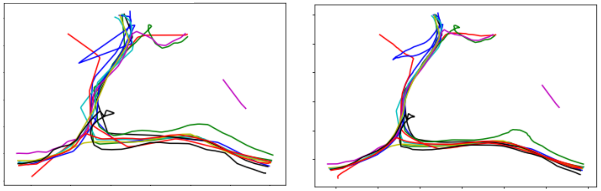

.. currentmodule:: algo.geometry

Trajectory Geometry Processing
================================

**algo.geometry module**

This module provides functions aimed at 

.. autosummary::
   :nosignatures:

   snap_lines_to_connect
   decoupe_trace
   extend_extremity
   find_connection_candidate
   pull_point_to_other_tracks

snap_lines_to_connect
-------------------------------------------------------

.. currentmodule:: algo.geometry

.. autofunction:: snap_lines_to_connect

Returns the closest edge that intersects an extension
-------------------------------------------------------

.. Search for the closest intersection between an extension and a neighboring edge.

.. currentmodule:: algo.geometry

.. autofunction:: find_connection_candidate

Move the trajectories closer together
--------------------------------------

  **Figure 1.** On the left, the traces are relatively sparse. On the right, after applying the algorithm, the traces are more tightly clustered, making them easier to detect.

.. currentmodule:: algo.geometry

.. autofunction:: pull_point_to_other_tracks

