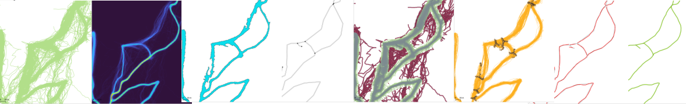

# Summary

# Statement of need

## Overview

* Calcul d’une carte de densité à partir des traces GNSS

* De la vectorisation on extrait une ligne centrée ≡ arc de la topologie. ([@Centerline2016])
* Attribue les points des traces brutes à chaque arc de la topologie
* Reconstruit les bons morceaux de traces candidats pour chaque arc de la topologie
* Agrégation des morceaux de traces
* Conflation des traces fusionnées afin d’obtenir un réseau de mobilité

# Conclusions

# References
